# MAUI Master-Detalle (Panadería) con SQLite y Dapper

Esta es una aplicación móvil construida con .NET MAUI que demuestra un flujo CRUD (Crear, Leer, Actualizar, Borrar) para un modelo de datos maestro-detalle basado en una **Panadería**.

La aplicación maneja dos entidades persistidas localmente usando SQLite y consultadas mediante el micro-ORM Dapper:
- **Categorías (Maestro):** Agrupaciones de panes o productos (Ej: Pan dulce, Pan salado, Bebidas).
- **Productos (Detalle):** Los items específicos a vender, los cuales pertenecen a una categoría.

## Características

- Base de datos local con SQLite.
- Inyección de dependencias para los repositorios de datos.
- Arquitectura limpia con acceso a datos encapsulado en `CategoriasRepository` y `ProductosRepository`.
- Validación de entradas y manejo de alertas en UI.
- Uso de `VerticalStackLayout` y `ScrollView` para diseño adaptable en dispositivos móviles.

## Requisitos

- Visual Studio 2022 o posterior (con carga de trabajo MAUI instalada).
- .NET 8 (o el SDK correspondiente configurado en el proyecto).

## Capturas de pantalla de la aplicación en ejecución

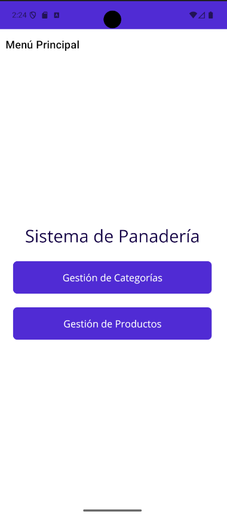

![Aplicación Ejecutándose - Maestro (Categorías)]
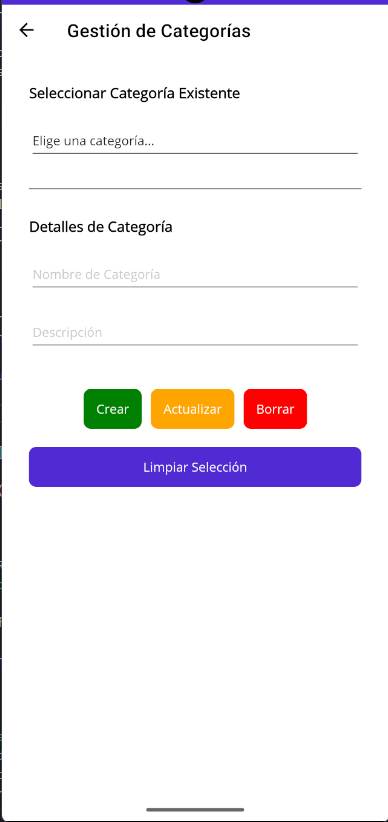

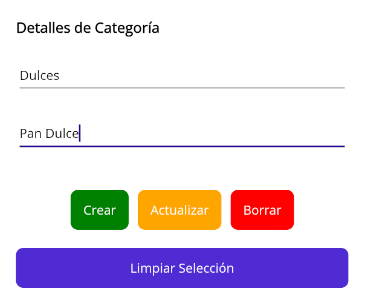

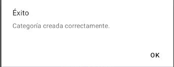

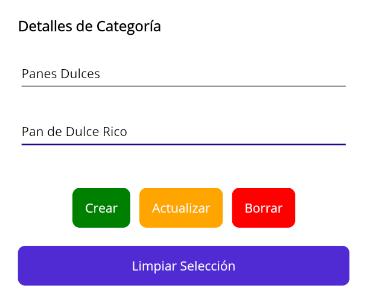

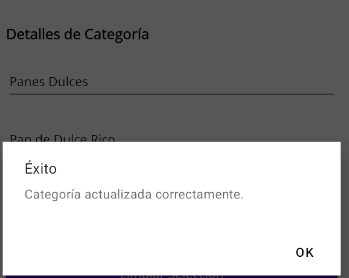

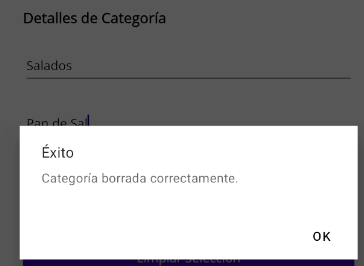

![Aplicación Ejecutándose - Detalle (Productos)]
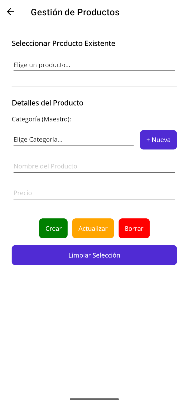

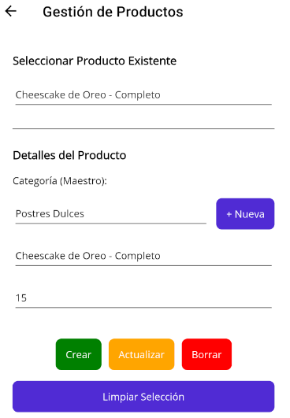

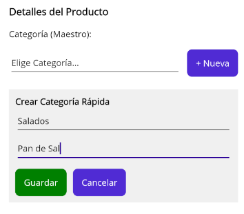

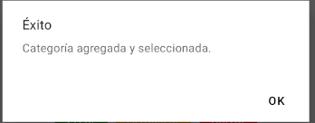

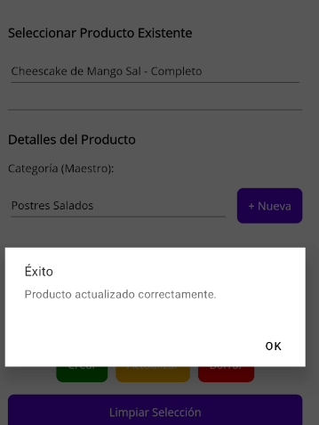

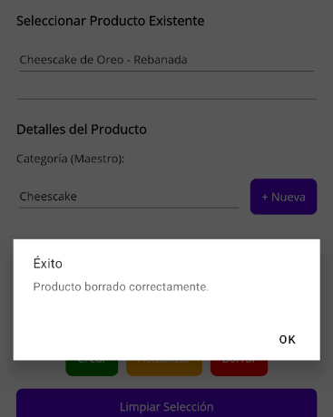
## Estructura del Proyecto

- `Models/Categoria.cs` y `Models/Producto.cs`: Representación de las tablas.
- `Data/CategoriasRepository.cs` y `Data/ProductosRepository.cs`: Lógica de conexión a SQLite y queries SQL con Dapper.
- `MainPage.xaml` y `MainPage.xaml.cs`: La interfaz gráfica de única pantalla dividida en las dos gestiones y su lógica de interacción.
- `MauiProgram.cs`: Configuración inicial del contenedor de inyección de dependencias (DI).

## Cómo Ejecutar

1. Clona el repositorio y abre la solución `UTN.appMovil.MestroDetalle.slnx` en Visual Studio 2022.
2. Selecciona tu emulador de preferencia (ej. Android Emulator o Windows Machine).
3. Presiona **F5** o haz clic en "Iniciar Depuración".
4. Prueba crear primero una **Categoría** (recuerda su ID) y luego úsalo para crear un **Producto**.
